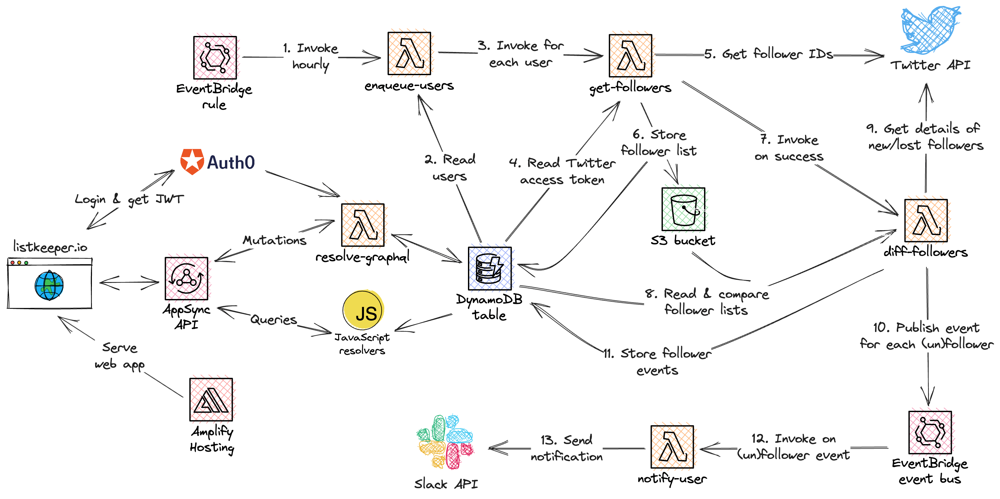

#  Listkeeper

## Note: I made Listkeeper open source after Twitter terminated API access in June 2023. See <https://artofserverless.com/listkeeper> for the full story.

Listkeeper keeps track of your Twitter followers _and_ unfollowers.

Twitter itself won't notify you about new followers whose accounts are protected. And it won't tell you about lost followers at all. Listkeeper does both.

## Motivation

> "Wanderer, there is no road, the road is made by walking." -- Antonio Machado

Listkeeper is my take on building a micro-SaaS from scratch. Rather than just following other founder's adventures, I'm using this project to actually _explore_ many aspects of creating a real product for real people.

While for the most part a labor of love -- I don't plan on monetizing a B2C product directly -- I do hope for Listkeeper to lay the foundation for future online businesses.

For this reason, it's essential to treat Listkeeper as a best-work project that takes time, energy, and attention to complete before I can move on to the next idea.

## Implementation

Listkeeper is supposed to be developed and maintained by a single person, which imposes constraints on how the service can be implemented (a good thing!).

To that end, Listkeeper's architecture and design need to be simple, robust, and cost-efficient -- all while keeping the primary goal of delivering value to users in mind. Scalability must not be a concern at this point.

Servers are a distraction; Listkeeper aims to be a 100% serverless solution powered by AWS Lambda, DynamoDB, and other managed cloud services.

Given my background, I expect frontend development to be both the biggest obstacle and greatest opportunity to learn.

## Architecture



Listkeeper is fully serverless contains a total of 4,000 lines of code:

- [Lambda functions](functions) - 2,000 lines of Go
- [CDK stacks](infra) - 500 lines of TypeScript
- [React frontend](app) - 1,000 lines of TypeScript
- Plus Makefiles, config data, etc.

## Deployment

Set your AWS region and credentials in the environment:

```console
export AWS_REGION=eu-central-1
export AWS_ACCESS_KEY_ID=...
export AWS_SECRET_ACCESS_KEY=...
```

Configure required SSM parameters (replace `/listkeeper-dev` with `/listkeeper-prod` for production):

```console
aws ssm put-parameter --overwrite --name /listkeeper-dev/twitter-consumer-key --type String --value <value>
aws ssm put-parameter --overwrite --name /listkeeper-dev/twitter-consumer-secret --type String --value <value>
aws ssm put-parameter --overwrite --name /listkeeper-dev/auth0-domain --type String --value <value>
aws ssm put-parameter --overwrite --name /listkeeper-dev/auth0-spa-client-id --type String --value <value>
aws ssm put-parameter --overwrite --name /listkeeper-dev/auth0-m2m-client-id --type String --value <value>
aws ssm put-parameter --overwrite --name /listkeeper-dev/auth0-m2m-client-secret --type String --value <value>
aws ssm put-parameter --overwrite --name /listkeeper-dev/github-oauth-token --type String --value <value>
```

Deploy the application:

```console
# Bootstrap AWS CDK once
make bootstrap

# Deploy development environment
make dev

# Deploy production environment
make prod
```

## Limitations

Due to Twitter's API rate limiting, Listkeeper will only work reliably for users with up to 75,000 followers (15 requests \* 5000 items, over 15 minutes). Beyond that limit, it becomes difficult to keep track of lost followers that aren't part of the first 75,000 items requested. (New followers are always added to the top of the follower list, while lost followers can be anywhere in the list.)

## License

Copyright (c) 2020-2023 Mathias Lafeldt

Listkeeper is licensed under the [Apache License, Version 2.0](LICENSE).
